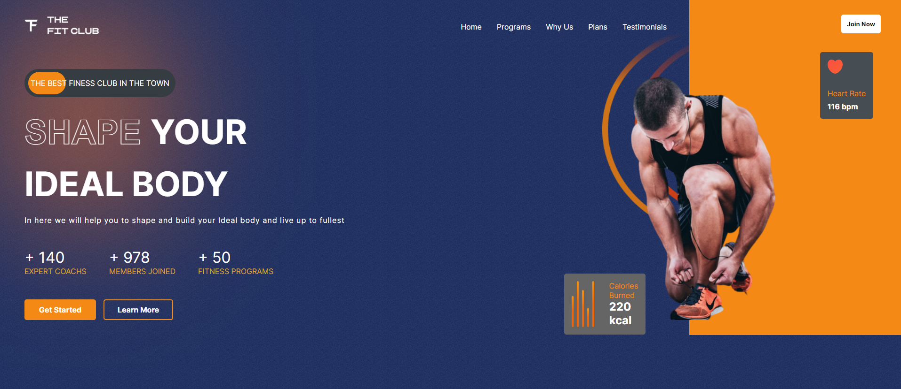
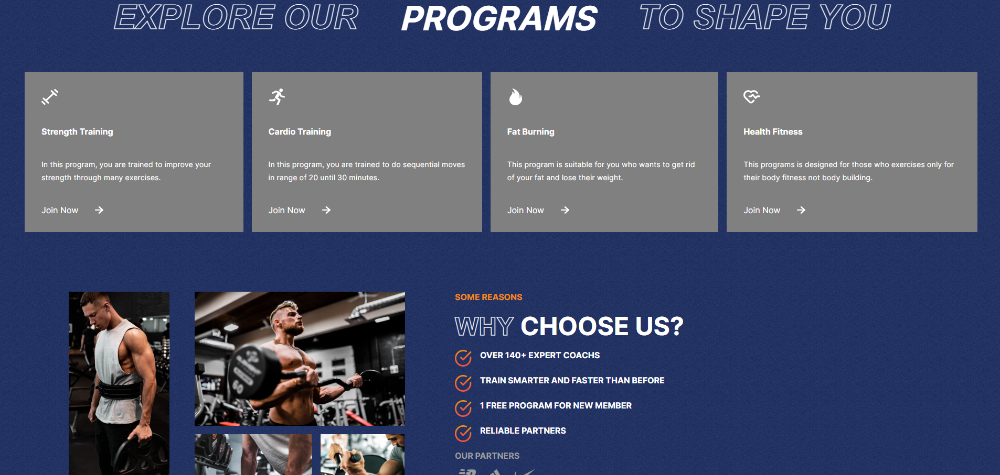
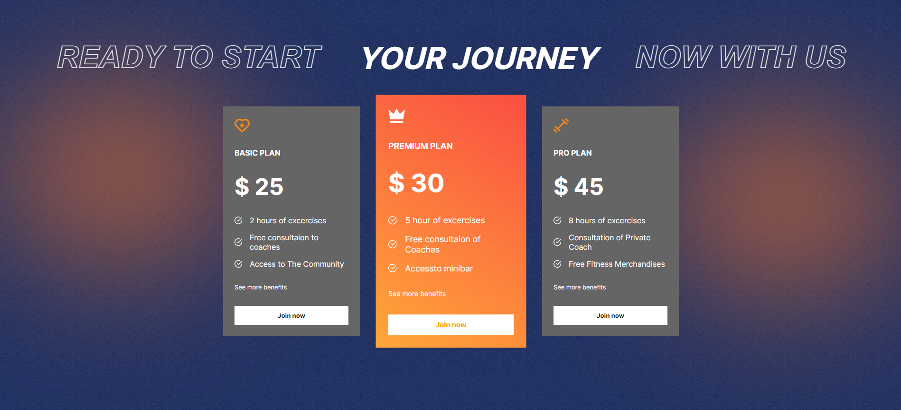
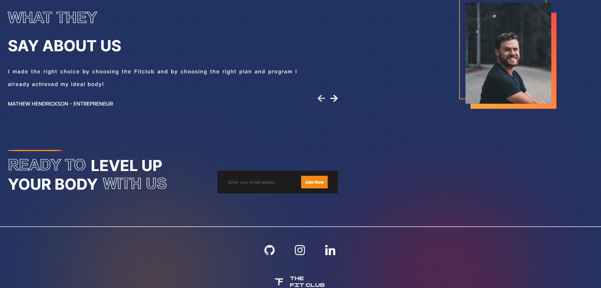

<h1 align="center"> GYM PROJECT </h1>

  <a href="#-tecnologias">Tecnologias</a>&nbsp;&nbsp;&nbsp;|&nbsp;&nbsp;&nbsp;
  <a href="#-projeto">Projeto</a>&nbsp;&nbsp;&nbsp;|&nbsp;&nbsp;&nbsp;

 

  
  
  
  

## 🚀 Tecnologias

Esse projeto foi desenvolvido com as seguintes tecnologias:

- HTML e CSS
- JavaScript
- [ReactJS](https://pt-br.reactjs.org/)
- [Node e NPM](https://nodejs.org/)
- [Vercel](https://gym-project-kappa.vercel.app/)

## 💻 Projeto

Projeto desenvolvido em React JS tem como objetivo criar um site de serviços oferecidos por um ginásio.  

[CLIQUE AQUI](https://gym-project-kappa.vercel.app/) PARA VISUALIZAR O PROJETO!

